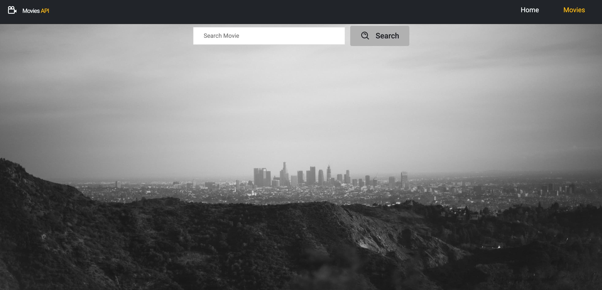

# **React Movie Info App**

## Project Overview

My first React project - getting trending movies and movies info from api.
The React Movie Info App is a web application designed to provide users with comprehensive movie information sourced from an external API. The primary goal of this project is to create a user-friendly interface for searching and exploring movie details, including cast, and reviews.

## Project Specifications

1. **Trending Movies:** Users can follow up best 20 trending movies nowadays.
1. **Movie Search:** Users can search for movies by title, allowing for easy discovery of films they are interested in.
1. **Movie Details:** The app provides detailed information about each movie, including its title, release year, genre, and an average score.
1. **Cast:** Users can explore the actors involved in the making of each movie.
1. **Reviews:** Users can check all the reviews lefting about movies.

## Key Features and Technologies Used

- **Front-End Framework:** 
- **Styling:** 
- **API Integration:** Utilizes a movie information API for data retrieval.
-  for making API requests
- **React Router:** The heart of the application, enabling seamless navigation and dynamic routing.
- **HashRouter with Routes and Route:** Employed to create a smooth and intuitive user experience.
- **Link and NavLink Components:** Used for easy navigation and active link styling.
- **URL Parameters:** Leveraged to access specific movie details and provide a tailored user experience.
- **Nested Routes:** Implemented with SharedLayout and Outlet for organized content display.
- **useNavigate Hook:** Enhanced navigation control for an engaging user experience.
- **useSearchParams:** Enables dynamic searching and filtering of movie information.
- **React.lazy and React Suspense:** Utilized for code splitting, ensuring efficient loading of app components.

## Project Purpose

The project serves both as a showcase of React development skills and as a practical tool for movie enthusiasts to quickly access movie-related information in one place.

## Project Preview

### Screenshots:

_Caption for Screenshot 1 (Main Page Trending Movies)_

_Caption for Screenshot 2 (Search Movies Page)_

## Challenges Faced

- Implementing API integration to fetch movie data in real-time by axios.
- Designing an intuitive and visually appealing user interface.
- Handling error responses from the API gracefully to ensure a seamless user experience.

## Learning Outcomes

Through this project, I gained valuable experience in React, state management, API integration, and user interface design. It also reinforced my problem-solving skills and the importance of handling data asynchronously in web applications.

## Future Enhancements

While the current version of the app provides essential movie information, future enhancements could include user accounts, the ability to save favorite movies.

## Issues

If you encounter any issues or have suggestions, please [open an issue](https://github.com/Alexandrbig1/movies-info/issues).

## License

This project is licensed under the [MIT License](LICENSE).

## Feedback

I welcome feedback and suggestions from users to improve the application's functionality and user experience.

## Thanks to **themoviedb.org** API for making this project possible!

## Languages and Tools

  
 

 

## Connect with me

  

  

